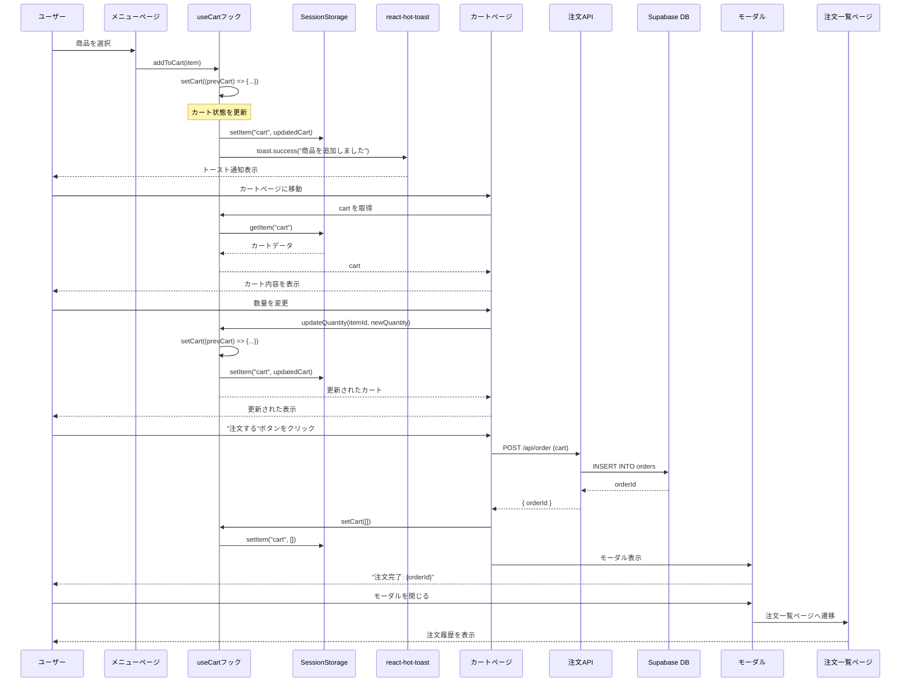
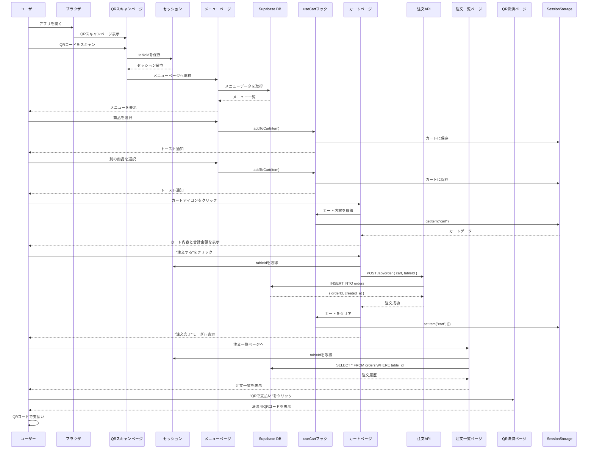
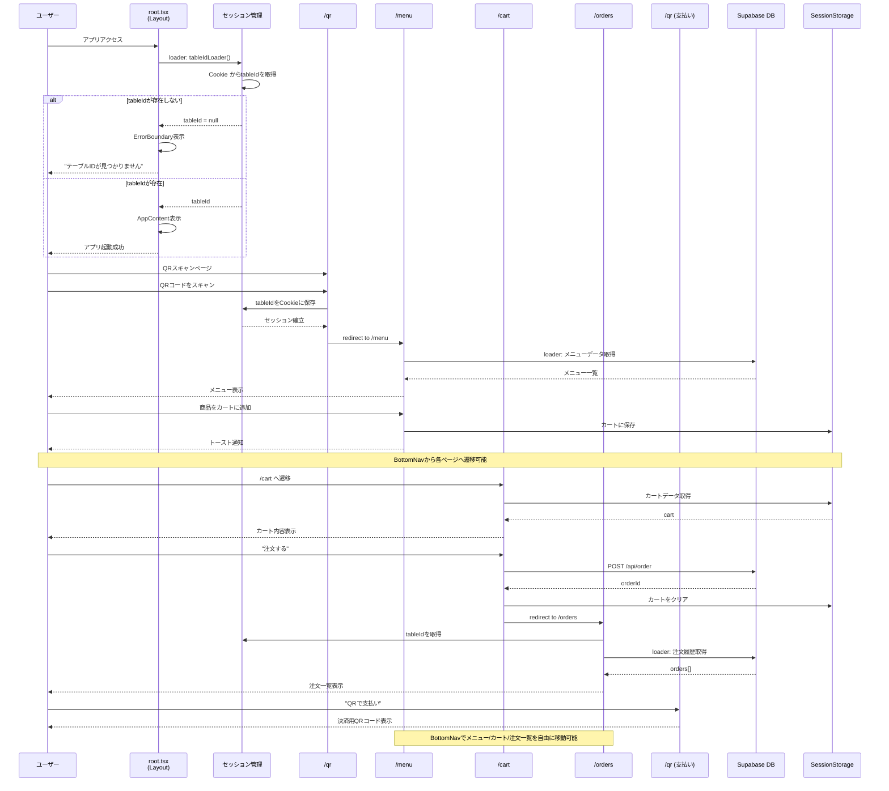
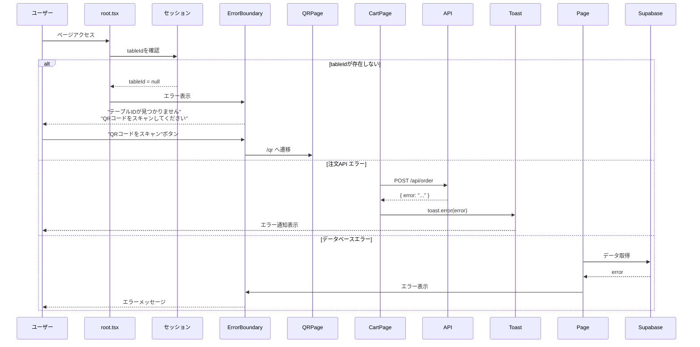

# システムアーキテクチャ - シーケンス図

このドキュメントでは、モバイルオーダーシステムの主要な機能フローをシーケンス図で説明します。

## 目次
1. [カート機能全体フロー](#1-カート機能全体フロー)
2. [メニュー閲覧から注文完了までの流れ](#2-メニュー閲覧から注文完了までの流れ)
3. [全ページの遷移とデータフロー](#3-全ページの遷移とデータフロー)

---

## 1. カート機能全体フロー

商品をカートに追加してから注文が完了するまでの流れ。

---

## 2. メニュー閲覧から注文完了までの流れ

ユーザーがアプリを開いてから注文を完了するまでの全体的な流れ。

---

## 3. 全ページの遷移とデータフロー

アプリケーション全体のページ遷移とデータの流れ。

---

## データフローの詳細

### セッション管理
- **Cookie**: `tableId`を保持（サーバーサイドで検証）
- **用途**: テーブルを識別し、注文をテーブルごとに管理

### クライアントサイドストレージ
- **SessionStorage**: カートデータ（`cart`）を保持
- **永続性**: ブラウザセッション中のみ有効
- **形式**: JSON配列 `[{ id, name, price, quantity }, ...]`

### データベース (Supabase)
- **orders テーブル**: 注文情報を保存
  - `order_id`: UUID（主キー）
  - `table_id`: テーブルID
  - `cart_items`: JSONB（注文内容）
  - `created_at`: タイムスタンプ

### 状態管理
- **useCart フック**: カート状態を管理
  - `cart`: 現在のカート内容
  - `addToCart()`: 商品追加
  - `updateQuantity()`: 数量変更
  - `removeItem()`: 商品削除
  - `setCart()`: カート全体を設定

---

## 主要コンポーネントとその役割

| コンポーネント | 役割 | 状態管理 |
|--------------|------|---------|
| `root.tsx` | レイアウト、セッション検証 | Cookieからのローダー |
| `QRPage` | テーブルID設定 | セッションへの書き込み |
| `MenuPage` | メニュー表示、商品追加 | useCart フック |
| `CartPage` | カート管理、注文送信 | useCart フック、useFetcher |
| `OrdersPage` | 注文履歴表示 | ローダーからのデータ |
| `BottomNav` | ページ遷移 | useNavigate |
| `useCart` | カート状態管理 | useState + SessionStorage |

---

## エラーハンドリング

---

## 技術スタック

- **フロントエンド**: React + Remix
- **状態管理**: React Hooks (useState, useEffect)
- **ルーティング**: Remix File-based Routing
- **スタイリング**: Tailwind CSS
- **通知**: react-hot-toast
- **データベース**: Supabase (PostgreSQL)
- **認証/セッション**: Remix Sessions (Cookie-based)

---

## 関連ドキュメント

- [トースト重複修正ドキュメント](./toast-duplication-fix.md)
- [カートフックの実装](../app/features/cart/hooks/useCart.ts)
- [セッション管理](../app/utils/session.server.ts)
