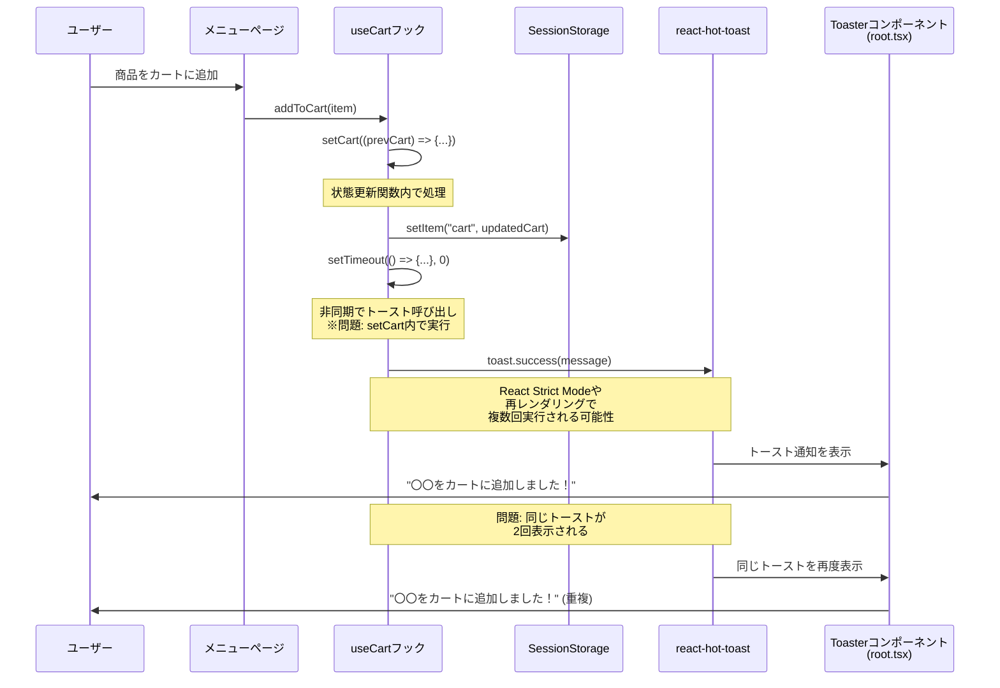
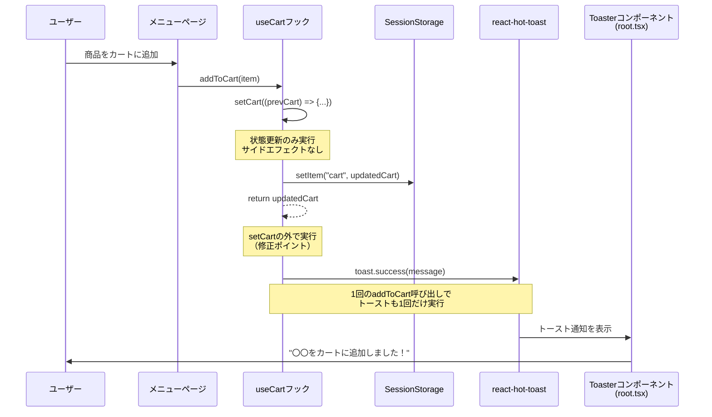

# トースト通知の重複表示問題と修正

## 問題の概要

カートに商品を追加した際に、トースト通知が2回表示される問題が発生していました。

## 現在の構成（問題あり）



## 問題の原因

### 1. トーストが`setCart`内で呼ばれている

**問題のコード** (`app/features/cart/hooks/useCart.ts`):

```typescript
const addToCart = (item: CartItem) => {
  setCart((prevCart) => {
    // ... カートの更新処理 ...

    sessionStorage.setItem("cart", JSON.stringify(updatedCart));
    setTimeout(() => {
      toast.success(`${item.name}をカートに追加しました！`); // ← 問題箇所
    }, 0);
    return updatedCart;
  });
};
```

**なぜ問題か:**
- Reactの状態更新関数（`setCart`のコールバック）内でサイドエフェクト（トースト表示）を実行している
- React Strict Modeでは開発時にコンポーネントが2回マウントされるため、状態更新関数も2回実行される
- コンポーネントの再レンダリング時にも複数回実行される可能性がある

### 2. `BottomNav`が重複配置

**問題のコード** (`app/root.tsx`):

```typescript
export function Layout({ children }: { children: React.ReactNode }) {
  return (
    <html lang="en">
      <body>
        {/* ... */}
        <Toaster />
        <Scripts />
        <BottomNav /> {/* ← 重複 */}
      </body>
    </html>
  );
}
```

- `root.tsx`でグローバルに配置されている
- 各ページでも個別に配置されている可能性がある

## 修正内容

### 1. トーストの呼び出しを`setCart`の外に移動

**修正後のコード**:

```typescript
const addToCart = (item: CartItem) => {
  setCart((prevCart) => {
    // ... カートの更新処理 ...

    sessionStorage.setItem("cart", JSON.stringify(updatedCart));
    return updatedCart; // サイドエフェクトを削除
  });

  // setCartの外でトーストを表示することで、重複実行を防ぐ
  toast.success(`${item.name}をカートに追加しました！`);
};
```

### 2. `root.tsx`から`BottomNav`を削除

```typescript
export function Layout({ children }: { children: React.ReactNode }) {
  return (
    <html lang="en">
      <body>
        {/* ... */}
        <Toaster />
        <Scripts />
        {/* BottomNavを削除 - 各ページで個別に配置 */}
      </body>
    </html>
  );
}
```

### 3. テストの追加

トーストの重複を検出するためのテストを追加:

```typescript
it("addToCartで新しいアイテムを追加すること", () => {
  const { result } = renderHook(() => useCart());

  act(() => {
    result.current.addToCart({
      id: "1",
      name: "Item 1",
      price: 100,
      quantity: 2,
    });
  });

  // トーストが1回だけ呼ばれることを確認
  expect(mockToastSuccess).toHaveBeenCalledTimes(1);
  expect(mockToastSuccess).toHaveBeenCalledWith("Item 1をカートに追加しました！");
});

it("addToCartを複数回呼んでも、各呼び出しでトーストが1回ずつ表示されること", () => {
  const { result } = renderHook(() => useCart());

  act(() => {
    result.current.addToCart({
      id: "1",
      name: "Item 1",
      price: 100,
      quantity: 1,
    });
  });

  expect(mockToastSuccess).toHaveBeenCalledTimes(1);

  act(() => {
    result.current.addToCart({
      id: "2",
      name: "Item 2",
      price: 200,
      quantity: 1,
    });
  });

  // 2回目の呼び出しで合計2回になる（重複ではなく、各呼び出しで1回ずつ）
  expect(mockToastSuccess).toHaveBeenCalledTimes(2);
});

it("React Strict Modeのような再レンダリングでもトーストが重複しないこと", () => {
  const { result, rerender } = renderHook(() => useCart());

  act(() => {
    result.current.addToCart({
      id: "1",
      name: "Item 1",
      price: 100,
      quantity: 1,
    });
  });

  const callCountAfterFirstAdd = mockToastSuccess.mock.calls.length;

  // 再レンダリングをシミュレート
  rerender();

  // 再レンダリング後もトーストの呼び出し回数が変わらないことを確認
  expect(mockToastSuccess).toHaveBeenCalledTimes(callCountAfterFirstAdd);
});
```

## 修正後の構成



## ベストプラクティス

### Reactの状態更新関数内でやるべきこと
- ✅ 状態の計算と更新
- ✅ 純粋な処理（同じ入力に対して同じ出力）

### Reactの状態更新関数内でやってはいけないこと
- ❌ サイドエフェクト（API呼び出し、ローカルストレージへの書き込み、トースト表示など）
- ❌ 非同期処理
- ❌ DOM操作

### 正しい実装パターン

```typescript
const updateState = (data) => {
  // 1. 状態更新（純粋な処理）
  setState((prev) => {
    const updated = computeNewState(prev, data);
    return updated;
  });

  // 2. サイドエフェクト（状態更新の外で実行）
  saveToStorage(data);
  showNotification(data);
  trackAnalytics(data);
};
```

## 関連ファイル

- `app/features/cart/hooks/useCart.ts` - カートフックの実装
- `app/features/cart/hooks/useCart.test.ts` - カートフックのテスト
- `app/root.tsx` - ルートレイアウト

## 参考リンク

- [React公式ドキュメント: Strict Mode](https://react.dev/reference/react/StrictMode)
- [React公式ドキュメント: useState](https://react.dev/reference/react/useState)
- [react-hot-toast](https://react-hot-toast.com/)
